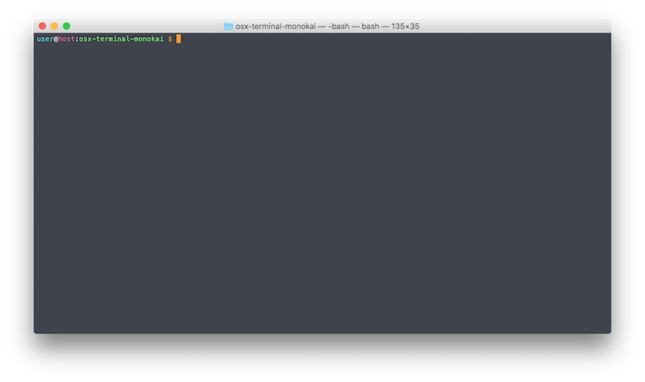

# Monokai OSX Terminal Theme
This repository contains a theme for the osx temrinal app in Monokai style.



Just clone this repository or download the `Monokai.terminal` file and import it in your terminal app.

## Specials
On startup the terminal runs:
```
export PS1="\[\033[38;5;45m\]\u\[$(tput sgr0)\]\[\033[38;5;15m\]@\[$(tput sgr0)\]\[\033[38;5;198m\]\h\[$(tput sgr0)\]\[\033[38;5;15m\]:\[$(tput sgr0)\]\[\033[38;5;83m\]\W\[$(tput sgr0)\]\[\033[38;5;15m\] \[$(tput sgr0)\]\[\033[38;5;202m\]\\$\[$(tput sgr0)\]\[\033[38;5;15m\] \[$(tput sgr0)\]" && clear
```
to set up the prompting style. This could override your exports in your `.bash_profile` or `.bashrc`.
